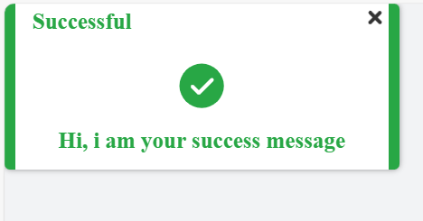
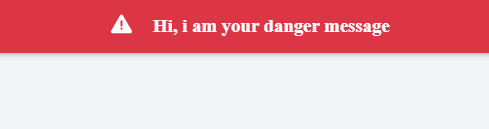
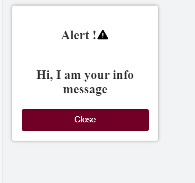
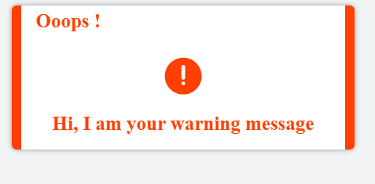

# Flash: A JavaScript Library for Creating Flash Messages


## Introduction

Flash is a lightweight, easy-to-use library for displaying Flash messages in your web application. It provides a simple API for creating and displaying Flash messages, and it comes with a variety of built-in templates that you can use to customize the look and feel of your messages.

## Installation

To install Flash, simply add the following script tag to your HTML document:

```html
<!--MINIFIED-->
<script src="https://cdn.jsdelivr.net/npm/@easylibs/flash@latest/dist/flash.min.js"></script>
<script src="https://unpkg.com/@easylibs/flash@latest/dist/flash.min.js"></script>
<!-- OR UNMINIFIED-->
<script src="https://cdn.jsdelivr.net/npm/@easylibs/flash@latest/dist/flash.js"></script>
<script src="https://unpkg.com/@easylibs/flash@latest/dist/flash.js"></script>
```

Or using npm, pnpm or yarn:

```bash
npm install @easylibs/flash
# OR
pnpm add @easylibs/flash
# OR
yarn add @easylibs/flash
```

## Usage

To use Flash, simply call the `Flash.add()` method and pass in the options for your Flash message. The following code shows how to create a simple Flash message:

```javascript
import Flash from '@easylibs/flash';

Flash.add({
  message: 'Hi, i am your success message',
  title: "Successful",
  type: 'success',
  icon:true,
  closeButton:true
});
```

This will create a Flash message with the text "Hi, i am your success message" and display it in a green box.



You can also pass in additional options to the `Flash.add()` method to customize the look and feel of your Flash message. The following table lists all of the available options:

| Option | Description |
|---|---|
| message | The text of the Flash message. |
| type | The type of Flash message. Can be one of the following: `success`, `danger`, `warning`, or `info`. |
| duration | The duration of the Flash message in milliseconds. |
| title | The title of the Flash message. |
| closeButton | Whether or not to show a close button on the Flash message. |
| container | The container in which to display the Flash message. |
| icon | Whether or not to show an icon on the Flash message. |
| tone | Whether or not to use a tone on the Flash message. |

## Customizing Flash Messages

You can customize the appearance of flash messages by overriding the default CSS styles. The default CSS styles are located in the `flash.css` file.

## Templates

The `Flash` message library offers two main approaches for displaying flash messages in your application. Below, you'll find an overview of each method along with a code snippet for implementation.

**`Using the Default Templates`**

Flash comes with a variety of built-in templates that you can use to customize the look and feel of your Flash messages. To use a template, simply set the template number to the `TEMPLATE` variable of the `Flash` class. The following code shows how to use the `default` template:

```javascript
import Flash from '@easylibs/flash';

Flash.TEMPLATE = 2;
Flash.add({
  message: 'Hi, i am your danger message',
  type: 'danger',
  title: "failed !",
  icon:true
});
```



**`Overriding the Default Template`**

You can customize the appearance of your flash messages by overriding the default template. This involves providing your own HTML structure and specifying locations for the `title` and `message`. Additionally, you can manage the close button functionality by adding the `_close_` attribute to the desired element. Note that this approach allows you to override the default CSS, provided you use the same class names as in the default template.

```css
body{
  background-color: #F2F3F5;
  box-sizing: border-box;
  padding:0;
  margin: 0;
}
.flash-box{
  width:200px;
  background-color: #FFFFFF;
  padding: 15px;
  margin:15px;
  box-shadow: 0 0 5px rgba(0, 0, 0, 0.400);
  border-radius: 3px;
}
.custom-flash-header {
    display: flex;
    justify-content: center;
    align-items: center;
}
.custom-flash-header span{
  display: flex;
  justify-content: center;
  align-items: center;

}
svg{
  width:20px;
  height:20px;
}
.flash-box, .custom-body{
  display:flex;
  flex-direction:column;
  justify-content:center;
}
.custom-body h3, .custom-body p{
  text-align:center;
  color:#333;
  font-size:20px;
  font-weight:600;
}
button{
  width:100%;
  height:35px;
  color:#FFFFFF;
  background-color:#720026;
  border:none;
  border-radius:3px;
  outline:none;
  cursor:pointer;
}
```

```javascript
import Flash from '@easylibs/flash';

Flash.TEMPLATE = `
<div class="custom-body">
    <div class="custom-flash-header">
        <h3>{{title}}</h3>
        <span>{{icon}}</span>
    </div>
    <p>{{message}}</p>
</div>
<button type="button" _close_>Close</button>`;

Flash.add({
  message: 'Hi, I am your info message',
  type: 'info',
  duration: 5000,
  title: 'Alert !',
  icon: true,
});
```

This will create a Flash message and display it in your custom templates.



## Attention

the order of execution is important in this case. If you want to override or change the default template, make sure that you set `Flash.TEMPLATE` before. In addition, two types of default templates are available and the `title` property is not supported by template `2` but only by template `1` and the custom template.

or add this code directly to your html, with the desired attributes. You will just need to execute the `Flash.add()` method without passing any parameters

*`HTML`*

```html
<!DOCTYPE html>
<html lang="en">
<head>
    <meta charset="UTF-8">
    <meta name="viewport" content="width=device-width, initial-scale=1.0">
    <title>Flash</title>
</head>
<body>
  <flash 
    message="Hi, I am your warning message" 
    type="warning" 
    title="Ooops !" 
    duration="5000" 
    icon="true">
  </flash>
  </body>
</html>
```

*`Javascript`*

```javascript
import Flash from "@easylibs/flash";
Flash.add()
```


