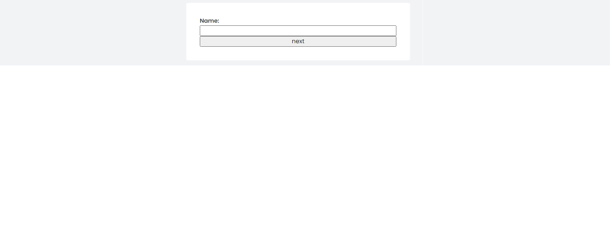

# Progress Form

The `ProgressForm` class provides a way to create a multi-step form with a progress bar. The form is divided into multiple fieldsets, and the user can navigate between the fieldsets using the "Next" and "Previous" buttons. The progress bar indicates the user's progress through the form.


## Installation

To install the `ProgressForm` class, you can use npm:

```bash
npm install @easylibs/progress-form
# Or
yarn add @easylibs/progress-form
# Or
pnpm add @easylibs/progress-form
```

Or use direct inclusion with CDN:

```html
<!--MINIFIED-->
<script src="https://cdn.jsdelivr.net/npm/@easylibs/progress-form@latest/dist/progress-form.min.js"></script>
<script src="https://unpkg.com/@easylibs/progress-form@latest/dist/progress-form.min.js"></script>
<!-- OR UNMINIFIED-->
<script src="https://cdn.jsdelivr.net/npm/@easylibs/progress-form@latest/dist/progress-form.js"></script>
<script src="https://unpkg.com/@easylibs/progress-form@latest/dist/progress-form.js"></script>
```

## Usage

To use the `ProgressForm` class, you need to create a form element and add the fieldsets to the form. Each fieldset should contain the inputs for one step of the form.

```html
<form id="progress-form" method="post">
        <div fieldset__parent>
          <div fieldset__container>
            <fieldset>
              <label for="name">Name:</label>
              <input type="text" id="name">
              <button type="button" __next__>next</button>
            </fieldset>
            <fieldset>
              <label for="surname">Surname:</label>
              <input type="text" id="surname">
              <button type="button" __prev__>previous</button>
              <button type="button" __next__>next</button>
            </fieldset>
            <fieldset>
              <label for="sex">Sex:</label>
              <select name="" id="">
                <option value="male">Male</option>
                <option value="female">Female</option>
              </select>
              <button type="button" __prev__>previous</button>
              <button type="button" __next__>next</button>
            </fieldset>
            <fieldset>
              <label for="email">Email:</label>
              <input type="email" id="email" name="email">
              <button type="button" __prev__>previous</button>
              <button type="button" __next__>next</button>
            </fieldset>
            <fieldset>
              <label for="password">Password:</label>
              <input type="password" id="password"  name="password">
              <button type="button" __prev__>previous</button>
              <button type="button" id="submitter">submit</button>
            </fieldset>
          </div>
        </div>
      </form>
```

Next, you need to create a `ProgressForm` object and pass the form element to the constructor.

```javascript
import ProgressForm from "@easylibs/progress-form";
const form = document.getElementById('progress-form');
const progressForm = new ProgressForm(form);
```

Finally, you need to call the `run()` method on the `ProgressForm` object. This will initialize the form and add the event listeners for the "Next" and "Previous" buttons.

```javascript
progressForm.run();
```

**`NB:`** This configuration is normally sufficient to correctly initialize the form, but you may want to modify the width of your form. We strongly recommend that you do this directly via the `translateX` property of `ProgressForm`, this will correctly adjust the movement of the Fieldsets

* Exemple:

```javascript
const translateX = -560;
progressForm.run({ translateX });
```

Note also that if you have required fields, the progress of the form will be automatically prevented in the event of an invalid field. Validation is only done on the client side via the corresponding HTML attributes, so there is no server-side validation

## Lazy running

The previous case evokes a particular situation. Let's assume that all fields are already available in the DOM. However, consider a time when we do not want to display all sets of fields simultaneously, but rather only display the first one, provided the user has successfully validated the data in the form to proceed to the next step.

To achieve this, `ProgressForm` offers a `lazyRun()` method which allows you to initialize only the process, then combined with the `next()` and `prev()` methods gives you full control over when you want to move to the next step.

***1- Create a backend file using the language of your choice, PHP in our case.***

```php
// backend.php
<?php
$template = [
    'template' => '<fieldset class="fieldset1">
                    <label for="name" required-field>Name:</label>
                    <input type="text" name="name" id="name">
                    <div class="button-container">
                      <button type="button" __prev__>previous</button>
                      <button type="button" __next__>next</button>
                    </div>
            </fieldset>'
];
$json_data = json_encode($template);
header('Content-Type: application/json');
echo $json_data;
?>
```

***2- Set first fieldset html***

```html
<form id="progress-form" method="post">
  <div fieldset__parent>
    <div fieldset__container>
      <fieldset> <!-- This is the first fieldset and is mandatory to start. !-->
        <label for="photo" required-field>Photo:</label>
        <input type="file" name="photo" id="photo" multiple="multiple">
        <button type="button" __next__>next</button>
      </fieldset>
    </div>
  </div>
</form>
<script type="module" src="./build/bundle.js"></script>
```

***3- run js progressForm instance***

```javascript
import Utils from "@easylibs/utils";
import FetchRequest from "@easylibs/fetch-request";

const form = document.querySelector("#progress-form");
const progress = new ProgressForm(form);

progress.lazyRun(6,{
  fieldsetParent:{
    width:"null"
  },
  fieldsetContainer:{
    justifyContent:'null' // It is recommended in lazyRun to disable the CSS property `justifyContent` of `fieldsetContainer` because due to its length, the other fields apart from the first one will end up outside the visible space.
  },
  fieldset:{
    width:"650px"
  },
});
```

**`lazyRun(fieldsetLength,progressOptions,styleOptions)`**
This method takes as its first argument the length of the fieldsets, which is simply the number of fieldsets you want to have, and then the two other arguments correspond to the first two arguments of the previous `run()` method.

```javascript
const nextButton = form.querySelector("button");

nextButton.addEventListener('click',()=>{
  new FetchRequest({
    uri:"http://localhost:8000/backend.php",
    options:{
      method:"POST",
      responseDataType:"text"
    },
    callbacks:{
      onSuccess(response) {
        // Convert the JSON text into HTML element
        const template = Utils.textToHTMLElement(response.template);
        const fieldsetContainer = document.querySelector('[fieldset__container]');
        // Select the previous button in the template
        const prevButton = template.querySelector("[__prev__]");
      },
    }
  })
})

```

At this stage, we already have the buttons to proceed to the next step and the one to go back to the previous step in order to be able to execute the next and prev methods. However, this is not sufficient because these two methods also require knowing the indexes and the value of the X translation of each fieldset, which is not obvious. To achieve this, we will use a variable `PROGRESSING_DATA` available during the execution of `lazyRun()`

```javascript
onSuccess(response) {
  // Convert the JSON text into HTML element
  const template = Utils.textToHTMLElement(response.template);
  const fieldsetContainer = document.querySelector('[fieldset__container]');

  // Select the previous button in the template
  const prevButton = template.querySelector("[__prev__]");

  // Retrieve variable
  const PROGRESSING_DATA = progress.PROGRESSING_DATA
  const nextIndex = PROGRESSING_DATA['fieldset1'].i;
  const nextTranslateX = PROGRESSING_DATA['fieldset1'].translateX;
  const prevIndex = PROGRESSING_DATA['fieldset1'].prev.i;
  const prevTranslateX = PROGRESSING_DATA['fieldset1'].prev.translateX;

  // Now, retrieve the CSS styles attached to the fieldsets.
  const renderedStyle = prsogress.RENDERED_STYLE.fieldsetStyle

  // Apply those styles to the template and append it in the DOM
  Object.assign(template.style,renderedStyle);
  fieldsetContainer.appendChild(template);

  // Finally, execute the next() and prev() methods by passing the corresponding parameters.
  /**
   * At this stage, the next() method does not need a nextButton because the click event has already been bound to this button during fetching. By executing the next() method like this, without a button, it will automatically run without waiting for a click, unlike the prev() method.
   */
  progress.prev(prevIndex,prevTranslateX,prevButton)
  progress.next(nextIndex,nextTranslateX)
},
```

Now, when the user clicks on the `next` button, the template `(fieldset1)` will be retrieved to the server. When the request is successful with a status 200, the template will be converted into an HTML element, injected into the DOM, and displayed as a normal progressive form thanks to the `next` method attached to its. Furthermore, if the user clicks on the `previous` button, they will be redirected to the preceding fieldset `(fieldset0)` thanks to the `prev` method attached to this button.
This approach will prove particularly effective for server-side form verification for exemple, unlike the previous approach.

## Styling

The `ProgressForm` class includes a default CSS style that you can use to style the form. You can also override the default CSS style by passing a `styleOptions` object to the `run()` method.

The `styleOptions` object can contain the following properties:

* `form`: The CSS style for the form element.
* `fieldsetParent`: The CSS style for the fieldset parent element.
* `fieldsetContainer`: The CSS style for the fieldset container element.
* `fieldset`: The CSS style for the fieldset elements.

**Alert ! `since version 1.1.10 it is no longer useful to modify the css style from the` `ProgressForm` `instance unless necessary.`**

* Exemple:
In this code we want to deactivate the `Width` properties of `Form` and `FieldSetParent`.

```javascript
const form = document.getElementById('progress-form');
const translateX = -560;
progressForm.run({ translateX }, {
  from:{
    width:"null"
  },
  fieldsetParent:{
    width:"null"
  }
});
```



* Note:  These elements do not contain all existing css properties, but only the one necessary for correct initialization of the form. You should therefore modify or add additional css properties from your css style sheet.

## Conclusion

The `ProgressForm` class simplifies the creation of multi-step forms with an integrated progress bar, enhancing user experience in navigating through complex input sequences. By dividing forms into manageable steps and providing a visual indicator of progress, this class streamlines user interactions and improves form completion rates.

With straightforward installation via npm and easy-to-use methods, integrating the `ProgressForm` into your web application can significantly enhance the form-filling experience for your users.

Remember to explore the customizable styling options provided by the class to harmonize the form's appearance with your website's design theme.

---
